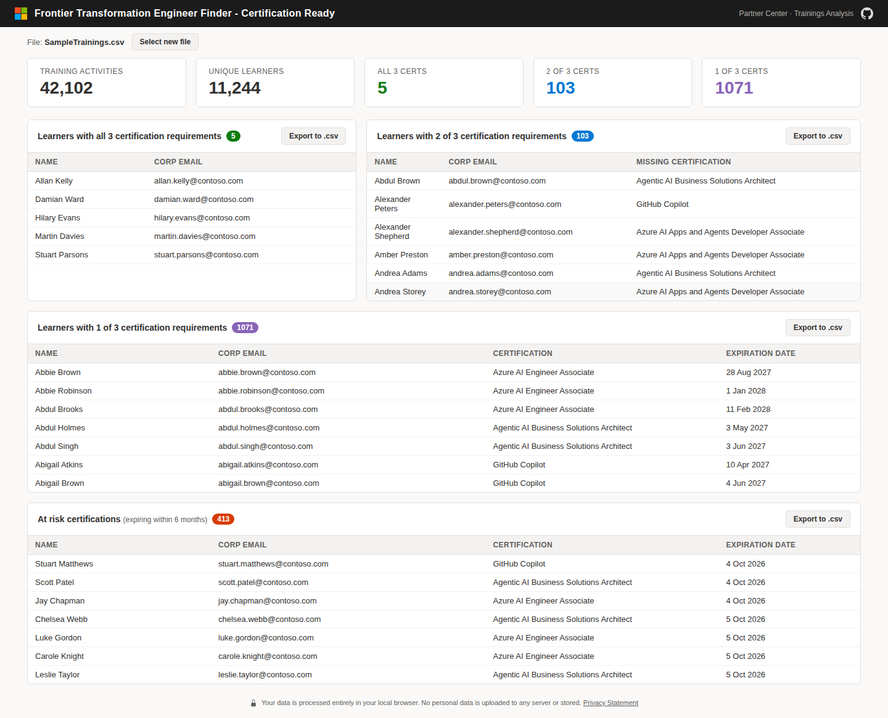

# Frontier Transformation Engineer Finder

A simple, in-browser tool that scans your Microsoft Partner Center training data and shows which learners are on track for the **Frontier Transformation Engineer** badge — based on three target certifications.

## What it does

The tool looks for learners who hold (or are close to holding) all three of these active certifications:

- **GitHub Copilot** (GH-300)
- **Agentic AI Business Solution Architect** (AB-100 + pre-reqs)
- **Developing AI Apps and Agents on Azure** (AI-103) - or - **Azure AI Engineer Associate**[^1] (AI-102)
 
The tool shows you four ready-to-use views:

1. **Learners with all 3** — Certification Ready.
2. **Learners with 2 of 3** — who they are, and which certification they still need.
3. **Learners with 1 of 3** — earlier in the journey.
4. **At-risk certifications** — target certs expiring within the next 6 months.

Each panel has an **Export to .csv** button so you can drop the list straight into Excel or send a mail-merge email.

## Try it instantly with the sample data

No installation, no sign-in.

1. **Download this repo** (green **Code** button on GitHub → *Download ZIP* → unzip), or grab the prepackaged [`releases/FrontierEngineer.zip`](https://aka.ms/FrontierEngineerFinder/Download).
2. **Double-click `web/index.html`** — it opens in your default browser (Edge, Chrome, etc.).
3. **Drag `data/SampleTrainings.csv`** onto the upload area (or click *Upload file* and pick it).

The sample is synthetic data for a fictional partner *Contoso*. You should see **5 learners with all 3**, **103 with 2 of 3**, and **1,071 with 1 of 3**.

## Use it with your real Partner Center data

| 🎥 Frontier Transformation Engineer Finder - Demo Video |
|---|
|  |
| [Watch on YouTube ↗](https://aka.ms/FrontierEngineerFinder/Video) |

1. Go to **[Partner Center Insights → Downloads Hub](https://partner.microsoft.com/en-us/dashboard/insights/analytics/downloadshub)**.
2. Sign in with a **[Global Admin](https://learn.microsoft.com/partner-center/account-settings/permissions-overview#global-admin-role)** account.
3. Choose **Create new report** → **Membership** → **Basic** → **Trainings** → **(Select all)** → **Lifetime** → **CSV** → **Download now**.
4. Open `web/index.html` and drag your downloaded CSV onto the upload area.

> **Your data stays private.** The file is processed entirely inside your browser — nothing is uploaded to any server or saved to disk.

## Other files in this repo

- **`notebooks/FrontierEngineer.ipynb`** — the same analysis as a Jupyter notebook, for analysts who prefer working in Python.
- **`src/mockdata.py`** — the script that generates `data/SampleTrainings.csv`, in case you want to regenerate or expand the synthetic dataset.

## License

See [LICENSE](LICENSE).

[^1]: Azure AI Engineer Associate will retire on June 30, 2026. The certification cannot be earned or renewed after this date, but the certification will count if still active on the learner's transcript.
