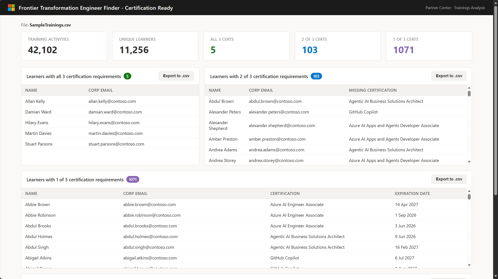

# Frontier Transformation Engineer Finder

A simple, in-browser tool that scans your Microsoft Partner Center training data and shows which learners are on track for the **Frontier Transformation Engineer** badge — based on three target certifications.

## What it does

The tool looks for learners who hold (or are close to holding) all three of these active certifications:

- **Microsoft Certified: Azure AI Engineer Associate** *(or the newer Azure AI Apps and Agents Developer Associate)*
- **GitHub Copilot**
- **Microsoft Certified: Agentic AI Business Solutions Architect**

It then shows you four ready-to-use views:

1. **Learners with all 3** — ready to be nominated.
2. **Learners with 2 of 3** — who they are, and which certification they still need.
3. **Learners with 1 of 3** — earlier in the journey.
4. **At-risk certifications** — target certs expiring within the next 6 months.

Each panel has an **Export to .csv** button so you can drop the list straight into email, Excel, or your CRM.

## Try it instantly with the sample data

No installation, no sign-in.

1. **Download this repo** (green **Code** button on GitHub → *Download ZIP* → unzip), or just grab `index.html` and `SampleTrainings.csv`.
2. **Double-click `index.html`** — it opens in your default browser (Edge, Chrome, etc.).
3. **Drag `SampleTrainings.csv`** onto the upload area (or click *Choose File* and pick it).

The sample is synthetic data for a fictional partner *Contoso*. You should see roughly **5 learners with all 3**, **103 with 2 of 3**, and **1,071 with 1 of 3**.

## Use it with your real Partner Center data

1. Go to **[Partner Center Insights → Downloads Hub](https://partner.microsoft.com/en-us/dashboard/insights/analytics/downloadshub)**.
2. Sign in with a **[Global Admin](https://learn.microsoft.com/partner-center/account-settings/permissions-overview#global-admin-role)** account.
3. Choose **Create new report** → **Membership** → **Basic** → **Trainings** → **(Select all)** → **Lifetime** → **CSV** → **Download now**.
4. Open `index.html` and drag your downloaded CSV onto the upload area.

> **Your data stays private.** The file is processed entirely inside your browser — nothing is uploaded to any server or saved to disk.

## Other files in this repo

- **`FrontierEngineer.ipynb`** — the same analysis as a Python/Jupyter notebook, for analysts who prefer working in pandas.
- **`mockdata.py`** — the script that generates `SampleTrainings.csv`, in case you want to regenerate or expand the synthetic dataset.

## License

See [LICENSE](LICENSE).
